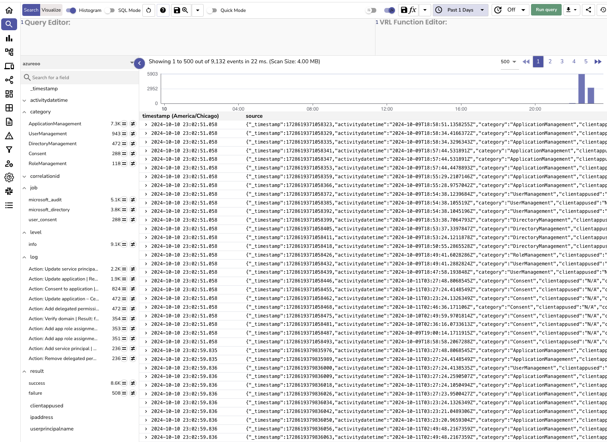

# Microsoft Graph API Connector for OpenObserve

This Go-based connector fetches logs from Microsoft Graph API, including audit logs, directory logs, sign-in activity, and consent approvals, and pushes them to OpenObserve for analysis.



### Steps Covered in the README:

1. **Microsoft App Registration**: How to set up the application in Azure and configure the required permissions.
2. **OpenObserve Details**: Instructions on how to retrieve access token from O2 dashboard.
3. **Environment Variables**: Instructions on how to use `.env` to store sensitive data and load it into the application.
4. **Running the Code**: Commands to run the Go program locally and in the background using `nohup`.
5. **Troubleshooting and Logs**: Instructions to monitor the logs of the connector.

## Features

- Fetches audit, directory, sign-in, and user consent logs.
- Continuously runs in the background, fetching logs every 5 seconds.
- Environment variables for configuration to protect sensitive data.
- Outputs logs to OpenObserve for monitoring and security insights.

---

## Prerequisites

- Go (version 1.16 or higher)
- An Azure AD App Registration with API permissions
- OpenObserve instance running and accessible

---

## 1. Microsoft Azure App Registration

To use this connector, you'll first need to register an application in Microsoft Azure to access the Graph API.

### Step 1: Register an App in Azure

1. **Log in to Azure Portal** at [Azure Portal](https://portal.azure.com).
2. Navigate to **Azure Active Directory** > **App registrations** > **New registration**.
3. Provide the following details:
   - **Name**: `GraphAPIConnector`
   - **Supported account types**: Choose **Single tenant** or the option that fits your setup.
   - **Redirect URI**: Leave it blank for now.
4. Click **Register**.

### Step 2: Configure API Permissions

1. Go to **API Permissions** in the app you just registered.
2. Click **Add a permission** > **Microsoft Graph** > **Application permissions**.
3. Add the following permissions:
   - **AuditLog.Read.All**
   - **Directory.Read.All**
   - **SignInActivity.Read.All**
4. **Grant Admin Consent** to these permissions.

### Step 3: Create Client Secret

1. Navigate to **Certificates & secrets** > **New client secret**.
2. Copy the **Client Secret** value as you will need it to configure the connector.

### Step 4: Collect Credentials

- **Tenant ID**: Found in **Azure Active Directory** under **Properties**.
- **Client ID**: Found in the **Overview** section of your registered app.
- **Client Secret**: The value generated when creating the client secret.

---

## 2. OpenObserve Details

1. **Log in to Open Observe**
2. Navigate to **Ingestion** > **Custom** > **OTEL Collector**.
3. Grab the token from **Authorization** header
4. Save this token to use in the next step

---

## 3. Environment Variables Configuration

You can configure the connector using environment variables to keep your credentials secure.

### Step 1: Create a `.env` File

Create a `.env` file in the root directory of the project with the following content:

```env
TENANT_ID=your-tenant-id
CLIENT_ID=your-client-id
CLIENT_SECRET=your-client-secret
ORG_ID=your-OpenObserve-org-name
STREAM_NAME=OpenObserve-stream-name-you-chose
OPEN_OBSERVE_HOST=your-OpenObserve-url
BASE64_CREDS=token-you-copied-from-above-step
```

### Step 2: Load Environment Variables

```env
go get github.com/joho/godotenv
```
---

## 4. Running the Connector

### Step 1: Running Locally

Once you have set up the environment variables, run the connector using:

```env
go run main.go
```

### Step 2: Running in the Background

To run the connector in the background and ensure it continues running, use nohup

```env
nohup go run main.go > log.txt 2>&1 &
```

---

## 5. Troubleshooting and Logs

- **Logs**: When the connector is run with `nohup`, the output will be logged to `log.txt`. To check the logs, run:
  ```bash
  tail -f log.txt
  ```